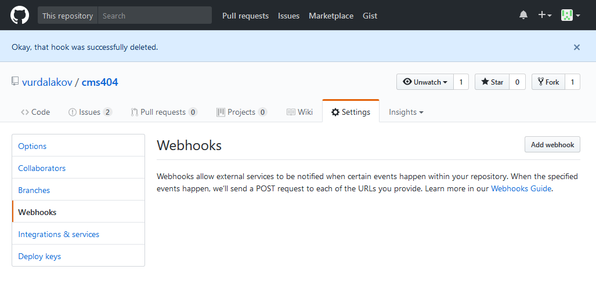
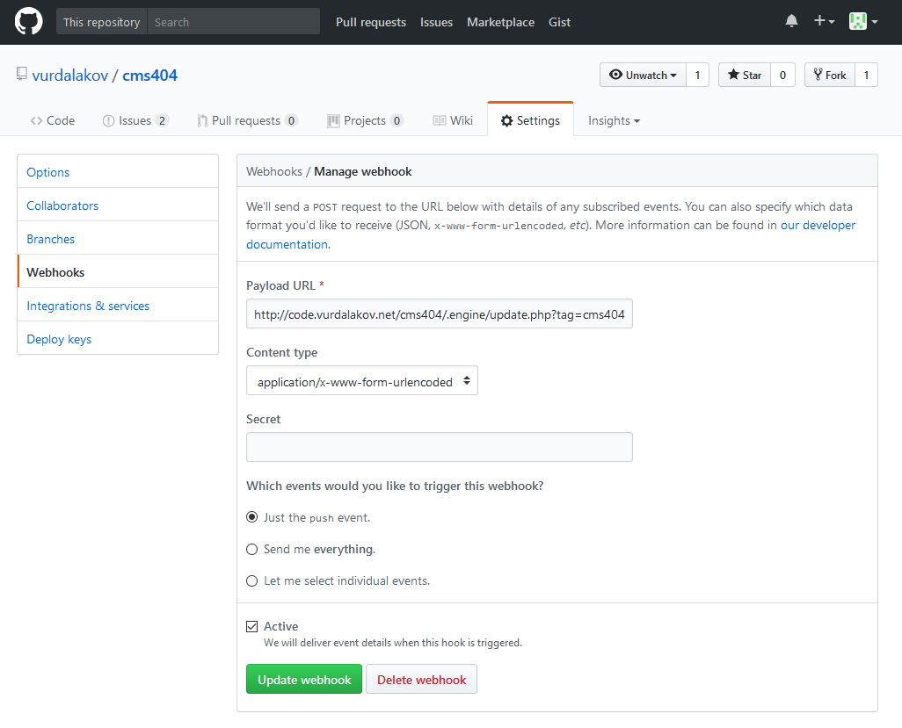

# Create webhook to update web site from Git repository

Webhook allows to update web site when `push` event is raised on GitHub, Bitbucket or other Git hosting.

## Create webhook in GitHub

1. Go to your repository home page.
2. Click `Settings` and then `Webhooks`.
3. Click `Add webhook` button.

4. Enter webhook URL in the `Payload URL` field to `<your web site root>/.engine/update.php?tag=<git tag>` URL.
5. Click `Add webhook` button.

